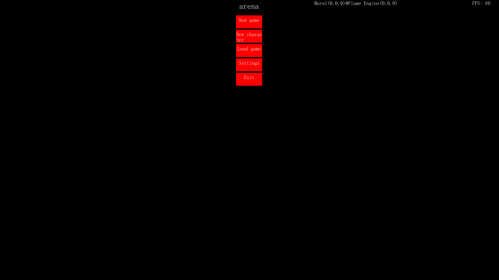
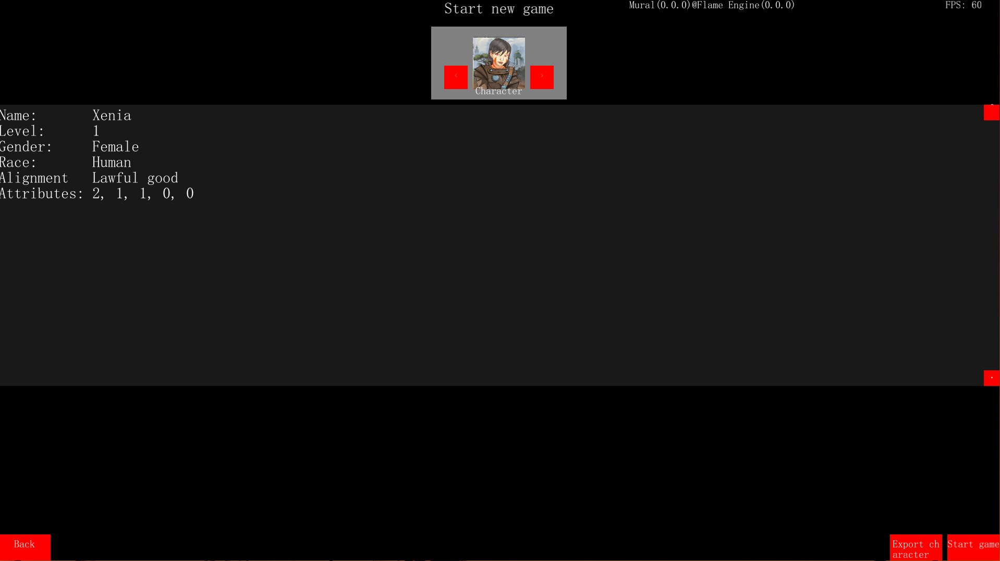
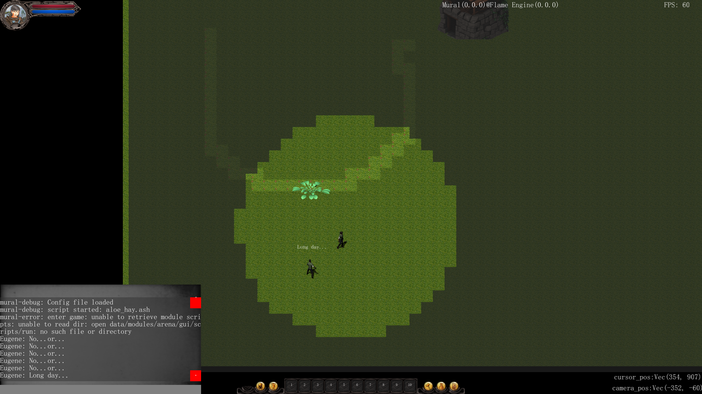

## Introduction
Mural is a 2D graphical frontend for [Flame](https://github.com/Isangeles/flame) RPG engine written in Go with [Pixel](https://github.com/faiface/pixel) library.

GUI uses [MTK](https://github.com/Isangeles/mtk), a simple toolkit built with [Pixel](https://github.com/faiface/pixel) library.

Currently in an early development stage.

### Flame games with Mural support:
### Arena


Description: simple demo game based on [Arena](https://github.com/isangeles/arena) module with [Mural GUI](https://github.com/isangeles/mural) support.

Download: [Linux](https://my.opendesktop.org/s/xmxszBXyMQCK5xB), [Windows](https://my.opendesktop.org/s/gcKQmFRdTj8sBdp), [macOS](https://my.opendesktop.org/s/5omoYQYMHGLXkfJ)

## Build
First, make sure you have dependencies required by [Pixel](https://github.com/faiface/pixel) and [Beep](https://github.com/faiface/beep).

Get sources from git:
```
go get -u github.com/isangeles/mural
```
Install GUI:
```
go install github.com/isangeles/mural@latest
```
Or with GOPATH mode simply:
```
go install github.com/isangeles/mural
```
After that, the GUI executable will be placed in your GOBIN directory(e.g. ~/go/bin).
## Run
Before starting GUI specify the ID of a Flame module in `.mural` configuration file:

Create file `.mural` in Mural executable directory(or run Mural to create it
automatically) and add the following line:
```
module:[module ID]
```
Mural will search the default modules directory(`data/modules`) for a module with the specified ID.

Flame modules are available for download [here](http://flame.isangeles.pl/mods).

Run Mural:
```
./mural
```
## Controls
### HUD:
WSAD - move HUD camera

Right mouse button - target object

Left mouse button - move player/interact with object(loot/dialog/attack)

SPACE - pause game

ESCAPE - open in-game menu

~ - activate chat

B - open inventory

K - open skills menu

L - open journal

V - open crafting menu

C - open character window
## Multiplayer
It's possible to join an online game hosted on the [Fire](https://github.com/isangeles/fire) server.

To connect to the remote server specify server host and port in `server` config value in the `.mural` configuration file.

After that Mural will try to establish a connection with the game server on startup.

If the connection was successful you can use the `login` menu to log in to the server.
## Configuration
Configuration values are loaded from `.mural` file in Mural executable directory.

### Configuration values:
```
  lang:[language ID]
```
Description: specifies game language, language ID is name of directory with translation files in lang directories.
```
  module:[module ID]
```
Description: specifies module from `data/modules` directory to load at start, module ID is ID specified in `.module` file inside main module directory.
```
  debug:[true/false]
```
Description: enables engine debug mode(shows debug messages in engine log), 'true' enables mode, everything else sets mode disabled.
```
  fullscreen:[true/false]
```
Description: enables fullscreen mode, 'true' enables fullscreen, everything else sets windowed mode.
```
  resolution:[width];[height]
```
Description: specifies current resolution.
```
  map-fow:[true/false]
```
Description: enables 'Fog of War' effect for an area map, 'true' enables FOW, everything else sets FOW disabled.
```
  main-font:[file name]
```
Description: specifies name of font file(located in graphic archive) for main UI font.
```
  music-volume:[int]
```
Description: specifies game music volume, 0 is system volume, <0 is quieter then system, >0 is louder then system.
```
  menu-music:[file name]
```
Description: specifies name of audio file(located in audio archive) for main menu music theme.
```
  button-click-sound:[file name]
```
Description: specifies name of audio file(located in audio archive) for button click sound.
```
  server:[host];[port]
```
Description: Specified server host and port for remote game server.
```
  server-user:[login];[password]
```
Description: Specifies user login and password for auto-login to the remote game server.

## Module directory
All GUI-related files, including UI textures, audio files, and translations for the GUI elements, must be stored in the `data/modules/[module name]/mural` directory.

UI textures and audio files need to be provided by module and stored in `mural/graphic.zip` and `mural/audio.zip` respectively.

You can find default audio and graphic archives in the `res` directory of this repository.

Translation for GUI elements needs to be stored in the `mural/lang` sub-directory of the module directory.

You can find default translations in the `res/lang` directory of this repository.

For example check [Arena](https://github.com/Isangeles/arena) module.
## AI
Mural uses AI API from [Ignite](https://github.com/Isangeles/ignite) to control NPCs.

All NPCs that should be controlled by the AI need to have the `igniteNpc` flag set.
## Commands
[Burn](https://github.com/Isangeles/burn) CI handles commands execution.

Additionally to Burn tools, Mural implements gui tools to manage game GUI.
You can access CI by the dropdown console in the main menu or chat window in HUD,
both accessible by pressing '`'(grave).

Note: all commands entered in HUD chat window must be prefixed by '$' character.

  Exit mural:
```
guiset -o exit
```
Description: exits program.

  Save HUD state:
```
guiimport -o gui-state -a [save name]
```
Description: saves current HUD state to file in current `/savegames` directory(`/savegames/[module]`).

  Load HUD state:
```
guiexport -o gui-state -a [save name]
```
Description: load HUD state from file in current `/savegames` directory(`/savegames/[module]`).

Mute music:
```
guiaudio -o set-mute -a true
```
Description: mutes/unmutes GUI music player.

Set music volume:
```
guiaudio -o set-volue -a [value]
```
Description: sets specified value as current volume level(0 - system volue, <0 - quieter, >0 - louder).

## Scripts
Mural handles [Ash](https://github.com/Isangeles/burn/tree/master/ash) scripts placed in `[module dir]/mural/scripts` directory. To start script enter script name in chat window or game console with '%' prefix. Scripts from `run` sub-directory are started automatically on game start/load.

Area scripts are stored in `[module dir]/mural/chapters/[chapter id]/areas/[area id]/scripts` directory and started after area change.

## Documentation
Source code documentation can be easily browsed with `go doc` command.

Documentation for Burn commands in form of Troff pages is available under `doc/command` directory.

You can easily view documentation pages with `man` command.

For example to display documentation page for guiset command:
```
man doc/command/guiset
```

Note that documentation of Burn commands is still incomplete.

## Contributing
You are welcome to contribute to project development.

If you looking for things to do, then check [TODO file](https://github.com/Isangeles/mural/blob/master/TODO) or contact maintainer(dev@isangeles.pl).

When you find something to do, create a new branch for your feature.
After you finish, open a pull request to merge your changes with master branch.

## Contact
* Isangeles <<dev@isangeles.pl>>

## License
Copyright 2018-2021 Dariusz Sikora <<dev@isangeles.pl>>

This program is free software; you can redistribute it and/or modify
it under the terms of the GNU General Public License as published by
the Free Software Foundation; either version 2 of the License, or
(at your option) any later version.

This program is distributed in the hope that it will be useful,
but WITHOUT ANY WARRANTY; without even the implied warranty of
MERCHANTABILITY or FITNESS FOR A PARTICULAR PURPOSE.  See the
GNU General Public License for more details.

You should have received a copy of the GNU General Public License
along with this program; if not, write to the Free Software
Foundation, Inc., 51 Franklin Street, Fifth Floor, Boston,
MA 02110-1301, USA.
